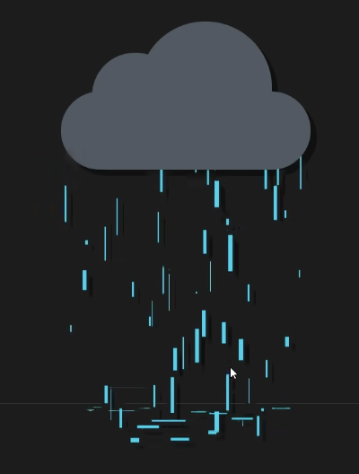

# Audio-Driven Interactive Prototype
Yuxuan Zhou

## How to Interact
1. Open the page in Chrome or Firefox.
- Allow microphone access.
- Make sounds or speak – louder sounds reveal a dark stormy overlay and animate the branch structures.

## My Animation Approach
- **Driver:** Audio input (using p5.Amplitude)
- **Animated Features:** 
  - Volume affects rain density and visibility of a black overlay (revealAmount).
  - Volume also causes left/right branches to sway slightly (swing1/swing2).
- **Uniqueness from Group:** While others in my group used mouse or time, mine is entirely audio-reactive and combines reveal + rotation.

## Inspiration
1. Personal experience: It often rains in Sydney in summer, which left a deep impression on me.
2. Raindrops and landing feedback:

The way he used simple geometric shapes to deconstruct raindrops inspired me.

## Technical Explanation

### 1. Packaging of the Source Code  
The project is organized into modular functions:
- `drawPolygon()` – Base polygons  
- `drawSplitCirclePrecise()` – Red-green split circles  
- `drawTopArch()` – Bottom arches  
- `drawPath()` / `drawCircles()` – Tree lines and shadows  
- `preload()` and `draw()` – Load and render background image

### 2. Additional Sound Recognition Features

#### Rain Intensity & Background Visibility  
- Sound above threshold → `revealAmount` increases → dark overlay & rain appears  
- Rain streaks and bottom splashes animate  
- Sound fades → rainstorm layer disappears

#### Tree Branch Movement  
- Microphone level → mapped to oscillation  
- `rotate(sin())` used to animate tree branches left–right  
- `push()`/`pop()` isolate movement of each side

---

## Code Notes

### 1. External references:
- p5.js sound: https://p5js.org/reference/#/libraries/p5.sound  
- lerp()easing: https://p5js.org/reference/#/p5/lerp  
- Rain effect:  
  https://editor.p5js.org/Skylarkroam/sketches/B1U0PVnC7  
  https://editor.p5js.org/xinxin/sketches/UXtL6HDSi  
- Branch motion:  
  https://editor.p5js.org/pasquini/sketches/cg0h5BAWu

### 2. AI Appendix:
I used AI to help check and explain this code.  
ChatGPT (accessed on May 25, 2025). https://chat.openai.com
