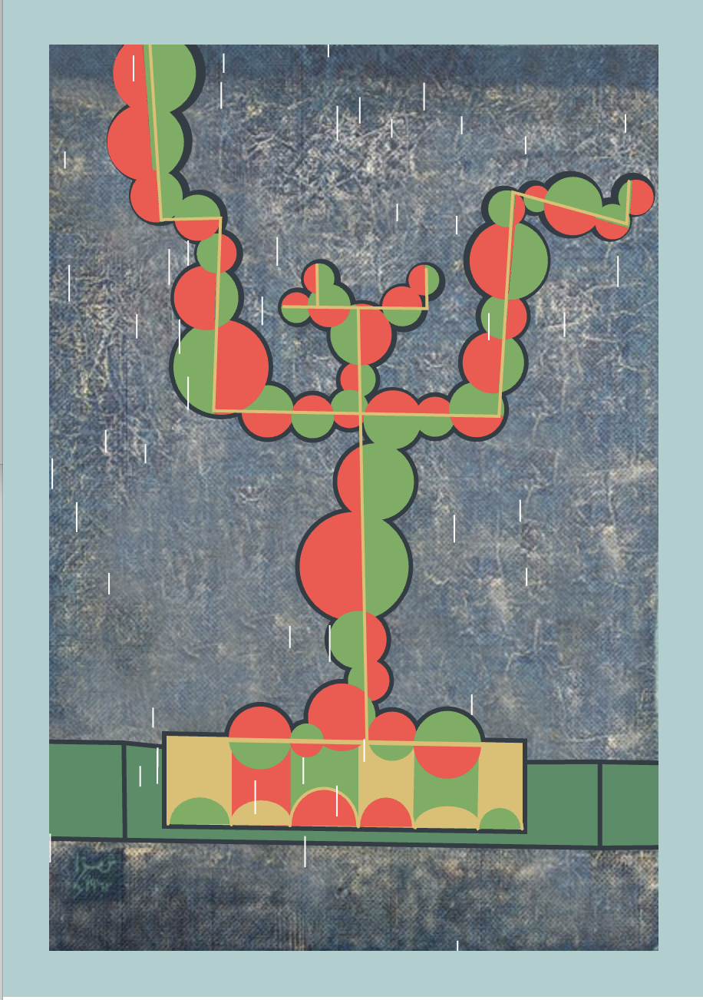
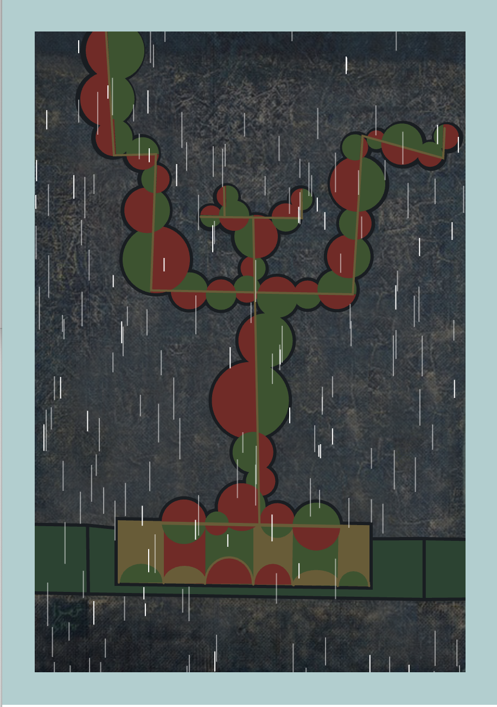
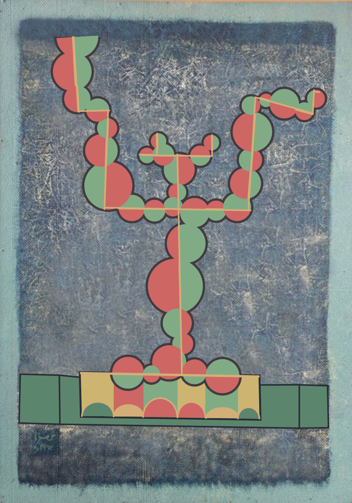
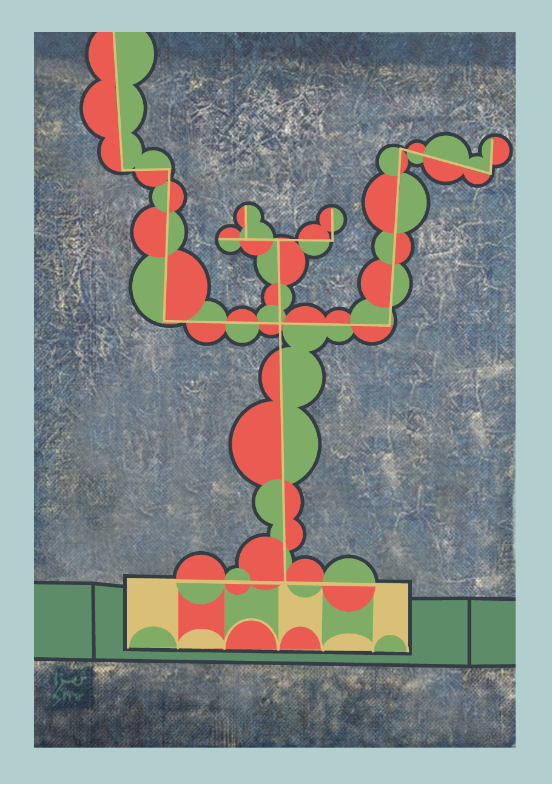

# Audio-Driven Interactive Prototype
Yuxuan Zhou

## How to Interact
1. Open the page using Chrome or Firefox.
2. Allow microphone access.
3. Make a sound or speak.
4. As the volume increases

- Heavier rainstorms
- Lower visibility
- More violent shaking of branches

## My Animation Approach
1. Audio input (using p5.Amplitude)

2. Animation features:
- Volume affects raindrop density and visibility of black overlay (revealAmount).
- Volume also affects the amplitude of tree branch swings (swing1/swing2/swing3).

3. Unique to my team: My teammates use mouse clicks or time variations, while my animations are completely audio driven, combined with "delay disappearing" and "branch swinging" interactions.

## Inspiration
1. Personal experience: It often rains in Sydney in summer, which left a deep impression on me.

2. Raindrops and landing feedback:

The way he used simple geometric shapes to deconstruct raindrops inspired me.
[Link Text](https://www.bilibili.com/video/BV1pj411E7w7/?spm_id_from=333.337.search-card.all.click&vd_source=f5195aced750d38e6b048d377b9b01f8)

3. Combined with common sense:
- The colors of trees should be brighter in summer

- I think trees need to respond to environmental changes
- Heavy rain is accompanied by lower visibility

## Technical Explanation
1. I sorted and packaged the original code:
- function drawCircles()
- function drawFrameOverlay()
- function drawSplitCirclePrecise()
- function drawTopArch()
- function drawPolygon()
- function drawPath()

2. Add voice recognition function：Use p5.AudioIn and p5.Amplitude to get the microphone volume input

3. Rain Intensity & Background Visibility
- Sound above threshold —— revealAmount rises, dark overlay & animated rain appears
- White streaks fall; bottom splashes bounce
- Sound drop —— rain layer fades out

4. Tree Branch Movement
- Microphone level —— oscillation frequency
- Branch groups wrapped in push()/pop() —— rotated via sin()

## Code Notes
1. External references:
- p5.js sound library: https://p5js.org/reference/#/libraries/p5.sound
- lerp() for Smooth adjustment: https://p5js.org/reference/#/p5/lerp
- Rain effect:  
https://editor.p5js.org/Skylarkroam/sketches/B1U0PvnC7
https://editor.p5js.org/xinxin/sketches/UXtL6HDSi
- Branch motion:  
https://editor.p5js.org/pasquini/sketches/cg0h5BAWu

2. AI Appendix:
I used AI to help me check my code for accuracy and clarity.  
ChatGPT (accessed on May 25, 2025). https://chat.openai.com
